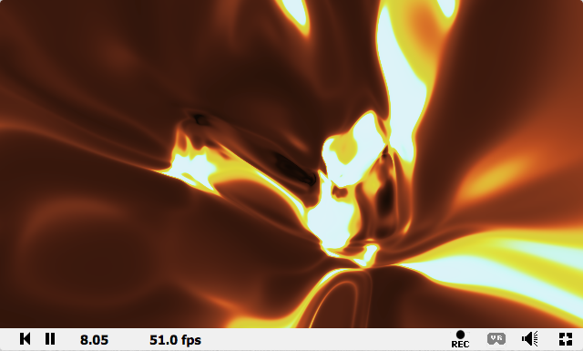
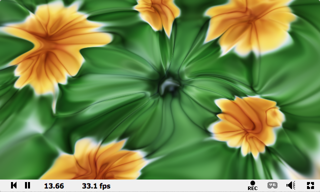
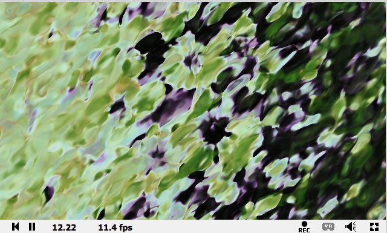
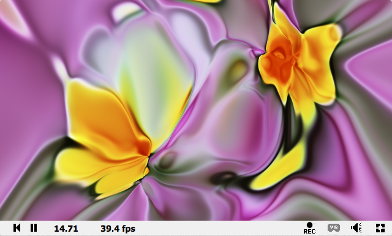

# Code for "Interactive CPPNs in GLSL"

This code goes along with the NIPS Creativity Workshop 2018 submission
"Interactive CPPNs in GLSL" by [Xavier Snelgrove](http://wxs.ca)
and [Matthew Tesfaldet](https://mtesfaldet.net/).

The Jupyter notebook [cppn2glsl.ipynb](cppn2glsl.ipynb) contains code for training a CPPN building
on the work from [Mordvintsev et al.](https://github.com/tensorflow/lucid/blob/master/notebooks/differentiable-parameterizations/xy2rgb.ipynb)

You can also replicate the results in your browser in a [colab notebook here](https://colab.research.google.com/drive/1ML89tc5BMcxWng8ib0XKWTTfcOx28JzZ)

## Examples of exported shaders

One of the export modes this supports is "Shadertoy" which outputs code compatible with the online
[Shadertoy](http://shadertoy.com) shader editor and community.

[View on Shadertoy (audio reactive)](https://www.shadertoy.com/view/lttBz2)

[View on Shadertoy (audio reactive)](https://www.shadertoy.com/view/ltcBDN)

[View on Shadertoy (warning, relatively resource intensive)](https://www.shadertoy.com/view/lt3fzj)

[View on shadertoy](https://www.shadertoy.com/view/MttfR2)

